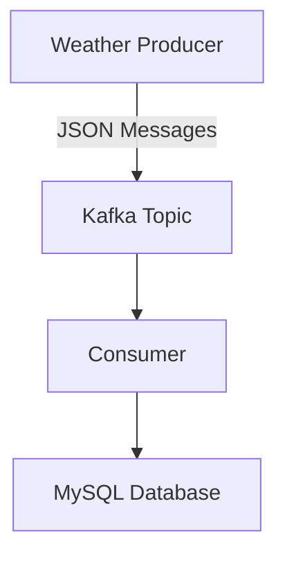
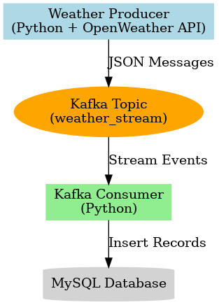
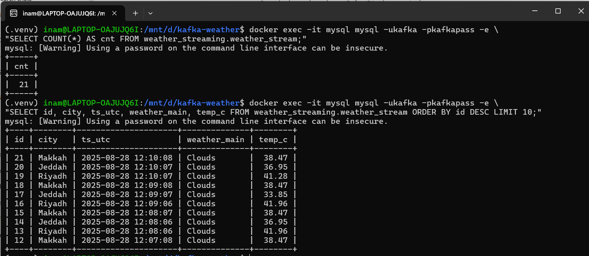

# 🌦️ Kafka Weather Streaming ETL


A real-time streaming data pipeline using **Apache Kafka**, **Python**, and **MySQL** to ingest, process, and store live weather data.

---

## ✨ Project Highlights

- ⚡ **Real-time streaming ETL**: Weather data produced via Kafka and consumed in real-time by Python consumers.  
- 🗄️ **Database integration**: All weather events are stored in a structured **MySQL** table for persistence and querying.  
- 🐳 **Fully containerized**: Kafka broker and MySQL services run seamlessly using **Docker Compose**.  
- 📊 **End-to-end demo**: Includes producer logs, consumer output, and MySQL query results to prove pipeline functionality.  
- 🔮 **Future-ready**: Easily extendable to Spark Structured Streaming, Confluent Cloud, and dashboarding with Grafana.  

---

## 📌 Project Overview
This project demonstrates:
- Producing weather data events with a Kafka **Producer**.
- Consuming events in real-time with a Kafka **Consumer**.
- Storing processed records in **MySQL**.
- A simple, production-style streaming ETL pipeline.

---

## ⚙️ Tech Stack
- **Apache Kafka** (Dockerized)
- **Python** (Producer & Consumer)
- **MySQL** (Database)
- **Docker Compose**
- **OpenWeather API** (Data source)

---

## 🛠️ Project Structure
```
kafka-weather-streaming/
│── docker-compose.yml        # Kafka & MySQL services
│── requirements.txt          # Python dependencies
│── producer_mock.py          # Test producer with mock data
│── producer_openweather.py   # Producer using OpenWeather API
│── src/
│   ├── consumer_mysql.py     # Consumer saving data into MySQL
│   ├── consumer_print.py     # Consumer printing data to console
│   ├── producer_openweather_fast.py   # Fast producer variant
│   └── producer_openweather_loop.py   # Loop-based producer
│── .env.example              # Safe template for environment variables
│── README.md                 # Documentation
```

---

## 🚀 How It Works


---

## ▶️ Getting Started
1. Clone the repository:
   ```bash
   git clone https://github.com/Inam0217/kafka-weather-streaming.git
   cd kafka-weather-streaming
   ```

2. Create `.env` (based on `.env.example`) with your DB & API settings.

3. Start Kafka + MySQL:
   ```bash
   docker-compose up -d
   ```

4. Run a producer:
   ```bash
   python producer_openweather.py
   ```

5. Run a consumer:
   ```bash
   python src/consumer_mysql.py
   ```

---

## 📂 Assets

### ETL Pipeline
  
*Diagram of the streaming ETL pipeline from producer → Kafka → consumer → MySQL.*

### Kafka Producer & Consumer Logs
  
*Producer sends weather events, Consumer receives and inserts them into MySQL.*

### MySQL Table Output
  
*Sample query result showing ingested weather data stored in MySQL.*

---

## 🔮 Future Improvements

- [ ] Add **Spark Structured Streaming** for advanced transformations  
- [ ] Deploy pipeline to **Confluent Cloud / AWS MSK**  
- [ ] Build a **Grafana / Power BI Dashboard** for real-time visualization  
- [ ] Add **unit tests** for producer and consumer  
- [ ] Create a **CI/CD pipeline** with GitHub Actions for automated runs  

---

👨‍💻 Built with ❤️ by **Inam Ul Hassan**
